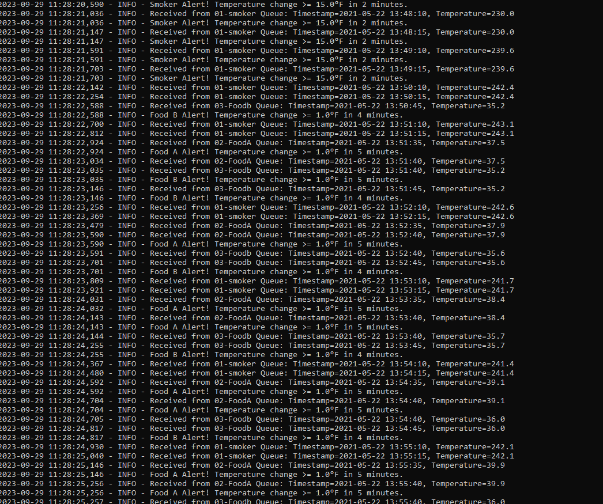

# SmartSmoker Temperature Monitoring and Alerting System
Mike Abbinante
29sep23
## Overview

The SmartSmoker Temperature Monitoring and Alerting System is a Python-based project that collects temperature data from a CSV file and sends it to RabbitMQ queues for further processing. It also logs temperature events and triggers alerts based on specific conditions. This system is designed for monitoring temperature in a smoker or similar environment. This project has been updated to have both a producer and consumer

## Features

- Reads temperature data from a CSV file.
- Sends temperature data to RabbitMQ queues based on type (e.g., smoker temperature, food A temperature, food B temperature).
- Logs temperature events and alerts to a log file.
- Monitors temperature changes and triggers alerts for specific conditions.
- Option to open the RabbitMQ Admin webpage for queue monitoring.

## Prerequisites

Before setting up and running the project, ensure you have the following prerequisites:

- Python 3.x installed.
- RabbitMQ server installed and running.
- Access to a CSV file with temperature data in the following format:
- Uses the following python modules for producer
    import pika
    import sys
    import webbrowser
    import csv
    import time
    import logging
- Uses the following python modules for consumer
    import pika
    import sys
    import logging
    from collections import deque
    from dateutil import parser
# Project Tasks
The project will perform the following tasks:
-Producer
   1. Establish a connection to the RabbitMQ server.
   2. Delete any existing queues with specific names (e.g., "01-smoker," "02-food-A," "03-food-B").
   3. Declare durable queues for each type of temperature data.
   4. Read data from the CSV file, send it to the appropriate RabbitMQ queue, and log events.
   5. Check for temperature alerts and log them accordingly.
   6. output into a log file ("SmartSmoker-temps.log") for detailed logs, including messages sent to queues, temperature alerts, and other events.
-Consumer
   1. Get information that was produced in the RabbitMQ server
   2. Process Temperature Data
   3. Check for temperature alerts
   4. output Log events to a log file("SmartSmoker-Consumer.log")
# Screenshots
-Running on machine 

-Consumer running on machine
-RabbitMQ web
-Rabbit MQ web + running on machine
